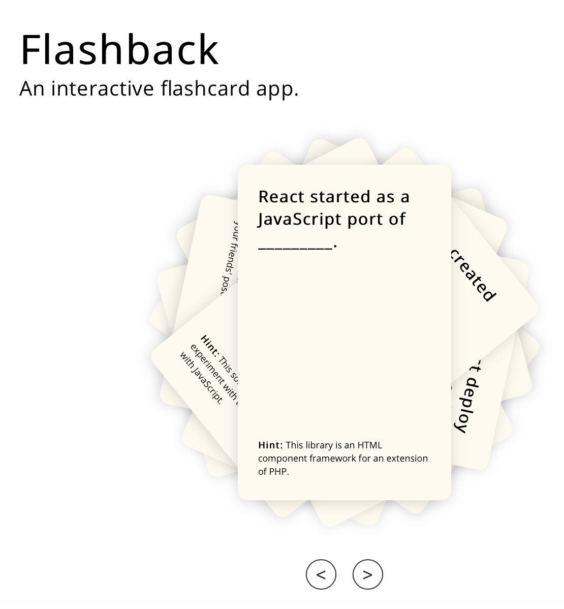

# About Flashback

A single page interactive flashcard app that tells the story of React and its role in the web industry.

Simply click on the arrows to switch back and forth between cards, and click on the card itself to reveal its answer. 

## Credits

* **The Coding Bootcamp** - *University of Texas - Austin* - [Course Link](https://techbootcamps.utexas.edu/coding/online/landing/?tc_ver=1&s=Google-Brand&pkw=ut%20austin%20coding%20bootcamp&pcrid=397231697230&pmt=e&utm_source=google&utm_medium=cpc&utm_campaign=GGL%7CUT-Austin%7CSEM%7CCODING%7C-%7CONL%7CTIER-1%7CALL%7CBRD%7CEXACT%7CCore%7CBootcamp&utm_term=ut%20austin%20coding%20bootcamp&utm_content=397231697230&s=google&k=ut%20austin%20coding%20bootcamp&gclid=EAIaIQobChMI16eEysjL5wIVh5OzCh03vAWNEAAYASAAEgKc8PD_BwE&gclsrc=aw.ds)

* *Rosy Arreola* - [Homepage](https://rosyarreola.netlify.com/)
